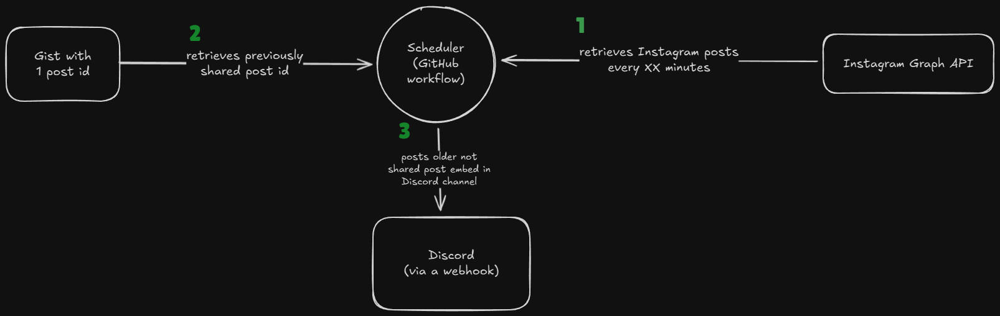

# insta-watchdog
This schedules a read of Instagram and if it finds a new post, it posts it in Discord. The new post ID is saved to be able to have the latest post shared.

I have a workflow to do this on a logical schedule. It also works with local values.